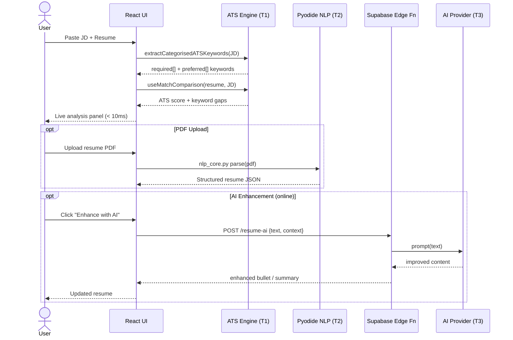

# FutureJobFit — AI-Powered Career Intelligence

> **Empowering professionals to bridge the gap between their experience and their dream career with a state-of-the-art, AI-driven recruitment intelligence platform.**


---

## Platform Briefing

**FutureJobFit** is not just a document editor — it is a high-performance career companion built for the modern job market. In an era where 75% of resumes are rejected by Applicant Tracking Systems (ATS) before a human ever sees them, this platform gives you the tools to fight back.

By combining **Minimal Futuristic Swiss design** with **multi-model AI intelligence**, the platform provides a seamless workflow for building, optimizing, and previewing your professional brand in real-time — in under 5 minutes.

---

## Design System

The interface follows a **Minimal Futuristic Swiss** design language, informed by the [ui-ux-pro-max](./design-system/futurejobfit/MASTER.md) skill output:

| Token | Value |
|-------|-------|
| **Style** | Exaggerated Minimalism + Swiss Grid |
| **Primary accent** | Electric Blue `hsl(231 100% 62%)` |
| **Secondary accent** | Vibrant Violet `hsl(265 90% 60%)` |
| **Tertiary** | Cyan `hsl(195 100% 50%)` |
| **Dark background** | OLED near-black `hsl(220 20% 4%)` |
| **Typography** | Inter — oversized, tight tracking (`-0.03em`), Swiss editorial scale |
| **Card effect** | Glassmorphism — `backdrop-filter: blur(16px)` + gradient borders on hover |
| **CTAs** | Electric blue → violet → cyan animated gradient with neon glow |
| **Navbar** | Floating pill — glassmorphic, centered, `max-w-5xl` |

### Design Tokens (`src/app/styles/index.css`)

```css
/* Core palette */
--primary:  231 100% 62%;   /* Electric Blue  */
--accent:   265 90%  60%;   /* Vibrant Violet */
--background: 220 20%  4%;  /* OLED Black     */

/* Gradients */
--gradient-accent:   linear-gradient(135deg, hsl(231 100% 62%) 0%, hsl(265 90% 60%) 100%);
--gradient-vibrant:  linear-gradient(135deg, hsl(231 100% 62%) 0%, hsl(265 90% 60%) 50%, hsl(195 100% 50%) 100%);
--gradient-border:   linear-gradient(135deg, hsl(231 100% 62%), hsl(265 90% 60%), hsl(195 100% 50%));

/* Effects */
--shadow-accent: 0 0 32px hsl(231 100% 65% / 0.3), 0 4px 16px hsl(231 100% 65% / 0.2);
--shadow-glass:  0 8px 32px rgb(0 0 0 / 0.6), inset 0 1px 0 hsl(0 0% 100% / 0.06);
```

### CSS Component Classes

| Class | Purpose |
|-------|---------|
| `.swiss-container` | Centered max-width layout container |
| `.swiss-section` | Consistent section vertical padding |
| `.swiss-divider` | Horizontal rule with gradient accent indicator |
| `.glass-card` | Glassmorphic card with blur + border |
| `.feature-card` | Hover-lift card with gradient border on hover |
| `.gradient-border-card` | CSS `::before` gradient border mask |
| `.neon-pill` | Badge with glow shadow |
| `.icon-container` | Square icon wrapper with accent tint |
| `.step-number` | Gradient-filled numbered circle |
| `.nav-floating` | Floating pill navigation bar |
| `.overline` | Uppercase tracking label above headings |
| `.brand-logo` | Gradient-clipped text for brand mark |
| `.gradient-text-animated` | Animated shifting gradient text |

---

## Application Walkthrough

### Home Page (`/`)

The landing page features:

- **Floating pill navbar** — glassmorphic, centered, links to all major routes
- **Hero Section** — oversized animated gradient headline, ambient orb backgrounds, dual CTA buttons
- **Stats Bar** — key metrics (3× interviews, 98% ATS pass rate, < 5 min build time)
- **Platform Capabilities grid** — 6 feature cards with gradient borders and icon containers
- **How It Works** — 4-step Swiss grid with numbered step indicators (01–04) and a gradient connector line
- **Final CTA** — glowing section with pulsing gradient button
- **Footer** — brand-consistent with Swiss divider accent

### Resume Wizard (`/resume-wizard`)

A comprehensive 10-step guided experience for building professional resumes:

| Step | Route | Description |
|------|-------|-------------|
| 1. Template | `/resume-wizard/template` | Choose from Modern, Professional, Minimal, or Creative templates |
| 2. Personal Info | `/resume-wizard/personal` | Contact details, location, and social links |
| 3. Summary | `/resume-wizard/summary` | Professional profile with AI enhancement presets |
| 4. Experience | `/resume-wizard/experience` | Work history with impact-focused bullet points and AI rewriting |
| 5. Education | `/resume-wizard/education` | Degrees, institutions, and academic achievements |
| 6. Skills | `/resume-wizard/skills` | Categorized skill sets (Technical, Soft Skills, Tools/Frameworks) |
| 7. Projects | `/resume-wizard/projects` | Portfolio projects with technology stacks |
| 8. Achievements | `/resume-wizard/achievements` | Quantifiable wins, awards, and recognitions |
| 9. Certifications | `/resume-wizard/certifications` | Professional licenses and courses |
| 10. Review | `/resume-wizard/review` | Final ATS check, live preview, and multi-format export |

**Key Features:**

- Real-time Preview — see changes instantly in the side panel
- Auto-Save — changes persist automatically to browser storage
- Undo/Redo — full history navigation (last 100 changes)
- AI Enhancement — one-click content improvement at each step
- Custom Sections — unlimited via `/resume-wizard/custom/:id`

### Job Optimizer (`/input` → `/results`)

**Step 1 — Job Input (`/input`)**

- Paste a job description into the text area
- The system retrieves your current resume from local storage
- Click "Analyze" to start the evaluation

**Step 2 — Analysis Results (`/results`)**

- ATS Score Dashboard — overall compatibility score (0–100%)
- Keyword Match Breakdown — visual representation of matching vs. missing keywords
- Gap Analysis — critical keywords in the JD missing from your resume
- AI-Powered Suggestions — contextual rewrites for experience bullets
- Optimized Resume — download an AI-rewritten version tailored to the job

### Match Intelligence (`/match-intelligence`)

Deep-dive resume-to-job compatibility analysis with scoring breakdowns, skill gap visualization, and AI-guided recommendations.

### About Platform (`/about-platform`)

Technical showcase featuring platform vision, intelligence architecture breakdown, performance metrics, and data models.

## System Architecture

```mermaid
graph TB
    subgraph Browser["🌐 Browser (Client)"]
        direction TB

        subgraph UI["React 18 + Vite 5 — UI Layer"]
            Home["🏠 Home / Landing"]
            Wizard["📝 Resume Wizard\n(10-step guided flow)"]
            Optimizer["🎯 Job Optimizer\n(/input → /results)"]
            Intelligence["🧠 Match Intelligence"]
            About["ℹ️ About Platform"]
        end

        subgraph State["State & Context"]
            ResumeCtx["ResumeContext\n(global resume state)"]
            JobCtx["JobContext\n(JD state)"]
            TanStack["TanStack Query\n(server cache)"]
            LocalStorage["localStorage\n(auto-save + Zod)"]
        end

        subgraph ATSEngine["🔍 ATS Engine (Tier 1 — always-on)"]
            KWExtract["extractCategorisedATSKeywords\n(ATS_KEYWORDS dictionary)"]
            ReqParse["extractRequirements\n(section-aware JD parser)"]
            MatchComp["useMatchComparison\n(weighted gap analysis)"]
            JobAnalyzer["useJobAnalyzer\n(role / insight detection)"]
        end

        subgraph NLP["🐍 Tier 2 — Pyodide NLP (WASM)"]
            Pyodide["Python 3.11 in WebAssembly"]
            NLPCore["nlp_core.py\n(resume parsing / scoring)"]
            PDFParse["pdfjs-dist\n(PDF text extraction)"]
        end

        subgraph Export["📤 Export Engine"]
            PDF["jsPDF → PDF / ATS-PDF"]
            DOCX["docx → .docx"]
            HTML["html2canvas → HTML"]
            Other["LaTeX / JSON / MD / TXT"]
        end

        subgraph PWA["📦 PWA / Service Worker"]
            SW["Workbox Service Worker"]
            Cache["Asset + Pyodide Cache\n(1-year TTL)"]
        end
    end

    subgraph Cloud["☁️ Cloud (Online-only)"]
        subgraph Supabase["Supabase Platform"]
            EdgeFn["Edge Function\nresume-ai"]
            DB["Postgres DB\n(user data)"]
            Auth["Supabase Auth"]
            Storage["Supabase Storage"]
        end

        subgraph Providers["AI Providers (Tier 3)"]
            Gemini["Google Gemini\n1.5 Flash / 2.0"]
            GPT["OpenAI GPT-4o-mini"]
            Groq["Groq Llama 3.3"]
        end

        CDN["jsDelivr CDN\n(Pyodide WASM runtime)"]
    end

    %% Data flows
    UI --> State
    State --> LocalStorage
    Optimizer --> ATSEngine
    ATSEngine --> KWExtract & ReqParse & MatchComp & JobAnalyzer
    Optimizer --> NLP
    NLP --> Pyodide --> NLPCore
    PDFParse --> NLPCore
    Wizard --> Export
    UI -->|"AI enhance / rewrite\n(online)"| Supabase
    EdgeFn -->|"model dispatch"| Gemini & GPT & Groq
    EdgeFn --> DB
    PWA --> SW --> Cache
    CDN -->|"first load"| Pyodide
    Cache -->|"subsequent loads"| Pyodide
```



### Three-Tier Intelligence System

| Tier | Engine | Availability | Latency |
|------|--------|-------------|---------|
| **Tier 1** | ATS keyword matching (ATS_KEYWORDS + regex) | Always | < 10ms |
| **Tier 2** | Pyodide NLP (Python/WASM) | Offline-capable | < 50ms |
| **Tier 3** | Cloud LLM (Gemini / GPT-4o / Groq) | Online only | 1–3s |

### Data Flow



### Online vs. Offline Capabilities

| Feature | Online | Offline |
|---------|--------|---------|
| Resume Builder (all steps) | ✅ | ✅ |
| ATS Keyword Scoring | ✅ | ✅ |
| Job Optimizer Analysis | ✅ | ✅ |
| PDF Export | ✅ | ✅ |
| All Export Formats | ✅ | ✅ |
| Pyodide NLP Parsing | ✅ | ✅ (cached) |
| AI Bullet Enhancement | ✅ | ❌ |
| AI Summary Generation | ✅ | ❌ |
| Full Resume Rewrite | ✅ | ❌ |

### Progressive Web App (PWA)

- Offline Support — core features work without internet
- Install Prompt — add to home screen on mobile/desktop
- Asset Caching — JavaScript, CSS, and NLP scripts cached
- Pyodide Caching — WebAssembly runtime cached for 1 year


---

## Getting Started

### Prerequisites

- [Node.js](https://nodejs.org/) v18.0+
- [npm](https://www.npmjs.com/) or [Bun](https://bun.sh/)

### Quick Installation

1. **Clone & Install**

   ```bash
   git clone https://github.com/vamshikittu22/future-job-fit.git
   cd future-job-fit
   npm install
   ```

2. **Environment Setup**

   ```bash
   cp .env.example .env.local
   ```

   Configure `.env.local`:

   ```env
   # Supabase (Required for AI features)
   VITE_SUPABASE_URL=your_supabase_project_url
   VITE_SUPABASE_PUBLISHABLE_KEY=your_supabase_anon_key

   # AI Provider Selection
   VITE_AI_PROVIDER=gemini

   # Offline-first mode (recommended for testing)
   VITE_PREFER_OFFLINE_ATS=true
   ```

3. **Launch**

   ```bash
   npm run dev
   ```

   Open `http://localhost:8080` to start building.

### Backend Configuration (Optional)

```bash
# Install Supabase CLI
npm install -g supabase
supabase login

# Set AI secrets
supabase secrets set GOOGLE_AI_API_KEY=your_gemini_key
supabase secrets set OPENAI_API_KEY=your_openai_key   # Optional
supabase secrets set GROQ_API_KEY=your_groq_key       # Optional

# Deploy Edge Function
supabase functions deploy resume-ai --no-verify-jwt
```

Windows setup script:

```powershell
./scripts/setup_ai_backend.ps1
```

---

## Export Formats

| Format | Description | Use Case |
|--------|-------------|----------|
| **PDF** | Selectable text, styled layout | Standard job applications |
| **ATS-PDF** | Pure text, no images | Maximum ATS compatibility |
| **DOCX** | Editable Word document | When employers request editable formats |
| **HTML** | Standalone web page | Portfolio websites |
| **LaTeX** | Academic typesetting | Technical/academic roles |
| **Markdown** | Plain text with formatting | Developer portfolios |
| **JSON** | Raw structured data | Backup and portability |
| **TXT** | Plain text | Copy-paste applications |

---

## Privacy & Security

- **No Data Collection** — your resume data never leaves your browser
- **Local Storage Only** — all data persists in browser localStorage
- **Server-Side AI Keys** — API keys stored securely in Supabase Secrets
- **Client-Side Exports** — all document generation happens in-browser
- **Optional API Key** — users can provide their own keys (sessionStorage only)

---

## Documentation & Guides

- [AI Integration Guide](./docs/AI_INTEGRATION.md) — Multi-tier intelligence architecture
- [Supabase Setup](./docs/SUPABASE_SETUP.md) — Edge Functions and AI gateway config
- [NLP & Offline Parser](./docs/NLP_SETUP.md) — Private, local resume analysis
- [Resume Wizard](./docs/RESUME_WIZARD.md) — Guided step-by-step experience
- [Job Optimizer](./docs/JOB_OPTIMIZER.md) — ATS scoring and keyword matching
- [Architecture](./ARCHITECTURE.md) — Full technical documentation
- [Design System](./design-system/futurejobfit/MASTER.md) — UI/UX design tokens and guidelines

---

## Available Scripts

| Command | Description |
|---------|-------------|
| `npm run dev` | Start development server on port 8080 |
| `npm run build` | TypeScript check + production build |
| `npm run preview` | Preview production build locally |
| `npm run lint` | Run ESLint with strict settings |
| `npm run test` | Run unit tests with Vitest |
| `npm run test:watch` | Run tests in watch mode |

---

## Technology Stack

| Category | Technologies |
|----------|-------------|
| **Frontend** | React 18, TypeScript 5, Vite 5 |
| **Styling** | Tailwind CSS 3, Shadcn/UI, Radix Primitives |
| **Design System** | Custom Swiss/Futuristic tokens, Glassmorphism, OLED palette |
| **Animation** | Framer Motion 10, CSS keyframes (`pulse-glow`, `gradient-shift`, `float`) |
| **State** | React Context, TanStack Query |
| **Forms** | react-hook-form + Zod validation |
| **AI** | Google Gemini, OpenAI, Groq (via Supabase Edge) |
| **Offline NLP** | Pyodide (Python in WebAssembly) |
| **Export** | jsPDF, docx, html2canvas, file-saver |
| **File Parsing** | pdfjs-dist, mammoth |

---

## Roadmap

- [x] Modular architecture refactor — all major pages componentized
- [x] Secure AI gateway — server-side key management via Supabase
- [x] Browser-native NLP — Pyodide integration for offline parsing
- [x] Import from PDF — advanced parsing using the local NLP suite
- [x] PWA support — installable app with offline capabilities
- [x] Multi-format export — 7+ formats with template support
- [x] **Minimal Futuristic Swiss redesign** — OLED palette, glassmorphism, animated gradients
- [ ] Tailored Cover Letter Generator
- [ ] LinkedIn Profile Sync
- [ ] Interview Prep Module

---

## License

MIT License — Built with precision for the high-performance career seeker.
